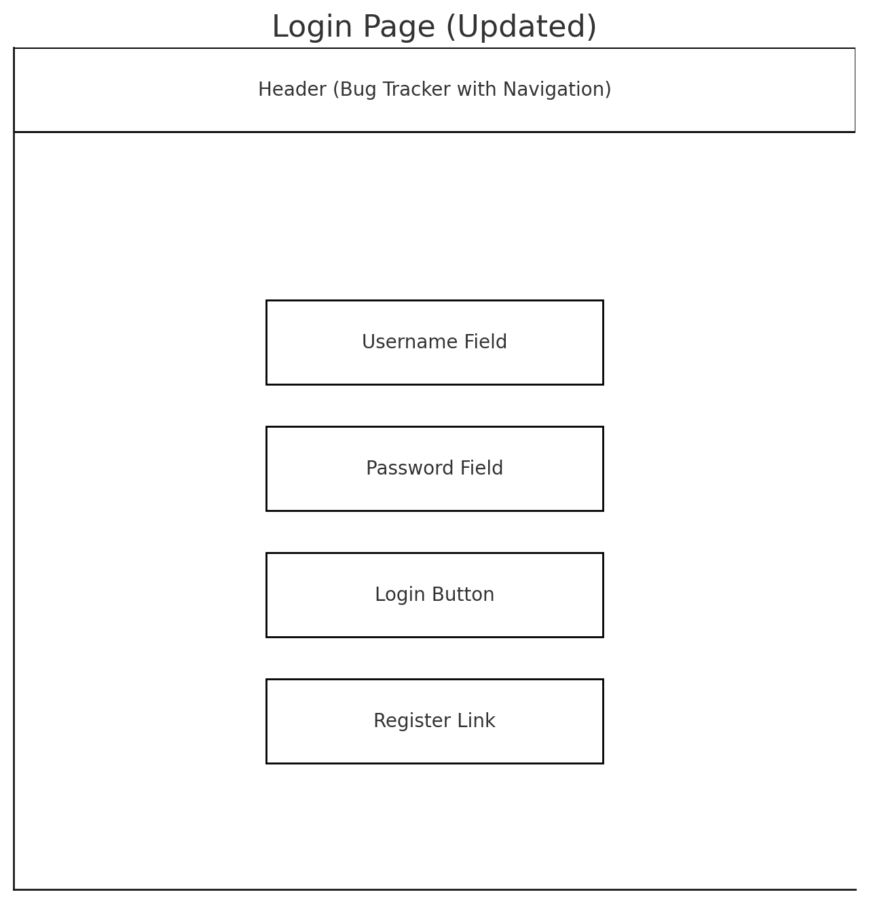
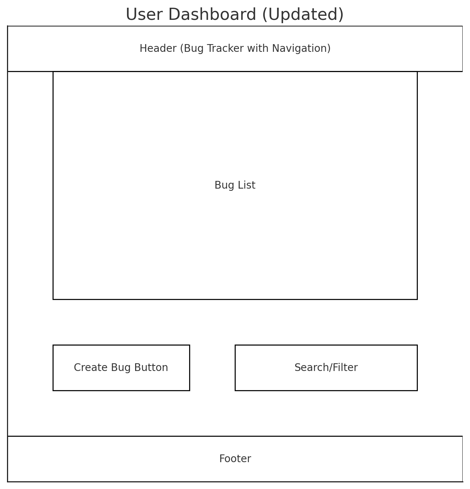
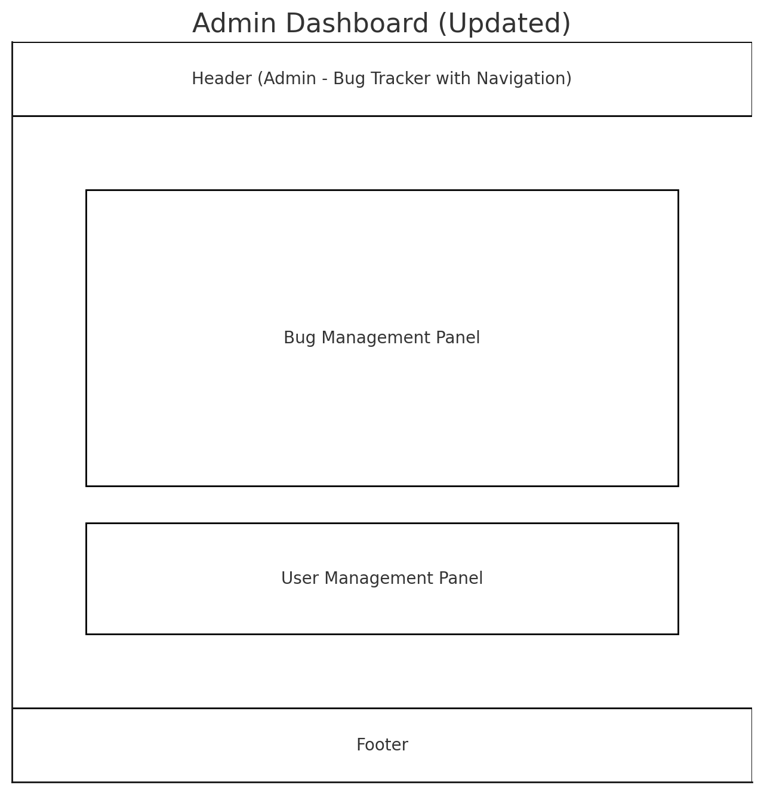
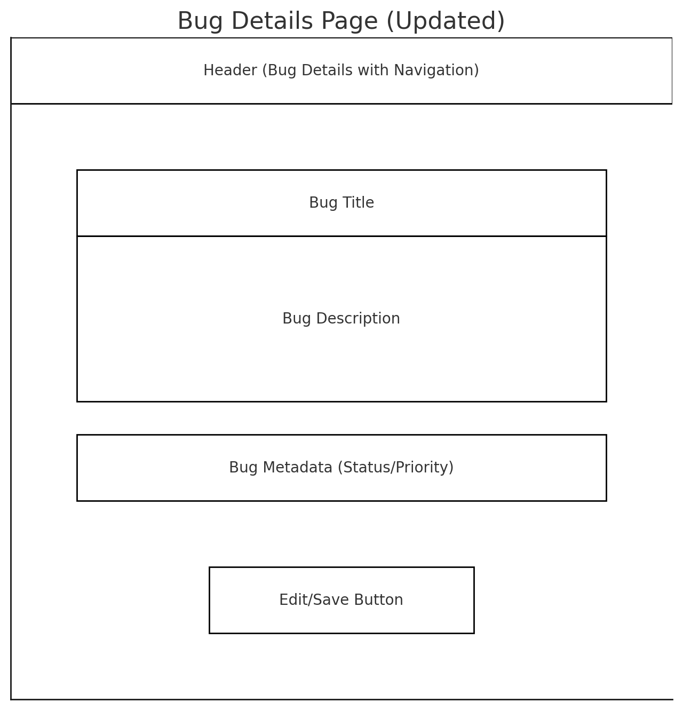

# 1. **Design Specification Document**

## 1.1. **Introduction**
The purpose of this design specification is to provide a detailed overview of the architecture, database schema, and user interface design for the Bug Tracker System. This document serves as a blueprint for the development phase, ensuring the system aligns with functional requirements and user needs.

---

# 2. **System Architecture**

## 2.1. **Overview**
The Bug Tracker System will be developed using the Flask framework. It will follow the **Model-View-Controller (MVC)** architecture to ensure modularity and maintainability. 

## 2.2. **Components**
1. **Frontend**:
   - HTML/CSS for structure and styling.
   - JavaScript for interactivity.
2. **Backend**:
   - Flask for request handling and business logic.
   - RESTful API endpoints for CRUD operations.
3. **Database**:
   - SQLite as the database management system for local development.

### 2.2.1. Component Diagram

```plantuml
package "Bug Tracker System" {
    [Frontend] <-down-> [Backend]
    [Backend] -down-> [Database]
}

package "Frontend" {
    component "User Interface" {
        [Login Page] --> [Dashboard]
        [Dashboard] --> [Bug Details Page]
        [Bug Details Page] --> [Form Validation]
    }
}

package "Backend" {
    component "Controller" {
        [AuthController] --> [User Model]
        [BugController] --> [Bug Model]
    }
    component "Business Logic" {
        [Auth Logic] --> [AuthController]
        [Bug Logic] --> [BugController]
    }
}

package "Database" {
    component "SQLite" {
        [Users Table] --> [Auth Logic]
        [Bugs Table] --> [Bug Logic]
    }
}
```


### 2.2.2. **Flow Diagram**

```plantuml
actor User as U
boundary Frontend as FE
control Backend as BE
database Database as DB

U -> FE: Access Login Page
FE -> BE: Send Login Credentials
BE -> DB: Validate User Credentials
DB --> BE: Return Validation Result
BE -> FE: Login Success/Failure Message
U <-- FE: Display Dashboard

U -> FE: Submit Bug Report
FE -> BE: Send Bug Details
BE -> DB: Insert Bug Record
DB --> BE: Confirm Bug Creation
BE -> FE: Display Success/Failure Message
U <-- FE: Confirm Bug Submission

U -> FE: Request Bug List
FE -> BE: Fetch Bugs
BE -> DB: Query All Bug Records
DB --> BE: Return Bug Data
BE -> FE: Pass Bug Data
U <-- FE: Display Bug List

U -> FE: Update Bug Record
FE -> BE: Send Update Request
BE -> DB: Update Bug Details
DB --> BE: Confirm Update Success
BE -> FE: Notify Update Success/Failure
U <-- FE: Display Update Confirmation

Admin -> FE: Perform CRUD Operations
FE -> BE: Send CRUD Request
BE -> DB: Execute Database Operation
DB --> BE: Confirm Operation Result
BE -> FE: Display CRUD Operation Feedback
Admin <-- FE: Notify Operation Completion
```

### 2.2.3. **Entity Relationship Diagram**
```plantuml
entity "Users" {
  + id : Integer [PK]
  --
  username : String
  password : String
  role : String
}

entity "Bugs" {
  + id : Integer [PK]
  --
  title : String
  description : Text
  status : String
  priority : String
  reported_by : Integer [FK]
  assigned_to : Integer [FK]
}

entity "Projects" {
  + id : Integer [PK]
  --
  name : String
  description : Text
}

Users ||--o{ Bugs : "reported by"
Users ||--o{ Bugs : "assigned to"
Projects ||--o{ Bugs : "associated with"
```

---

# 3. **Database Schema**
## 3.1. **Tables**
1. **Users Table**:
   - `id` (Integer, Primary Key)
   - `username` (String, Unique)
   - `password` (String, Encrypted)
   - `role` (String, Values: "user" or "admin")

2. **Bugs Table**:
   - `id` (Integer, Primary Key)
   - `title` (String)
   - `description` (Text)
   - `status` (String, Values: "Open", "In Progress", "Resolved")
   - `priority` (String, Values: "Low", "Medium", "High")
   - `reported_by` (Integer, Foreign Key referencing Users)
   - `assigned_to` (Integer, Foreign Key referencing Users)

_Optional Table: Projects (for future scalability)._
3. **Projects Tabl**:
    - `id` (Integer, Primary Key)
---

# 4. **User Interface Design**
## 4.1.  **Wireframes**
### 4.1.1. **Login Page**
   - Users enter their credentials to log in or register.
   - Includes validation for required fields.




### 4.1.2. **User Dashboard**
   - Displays a list of bug records.
   - Includes options to create or update bugs.
   - Search and filter capabilities.
   


### 4.1.3. **Admin Dashboard**
   - Panels for managing bugs and users.
   - CRUD operations for bug records.



### 4.1.4. **Bug Details Page**
   - Form for viewing and editing bug details.
   - Fields include title, description, status, and priority.



---

# 5. **Conclusion**
This design specification provides a comprehensive guide for building the Bug Tracker System. It aligns with functional requirements and ensures a modular, user-friendly, and scalable application.

